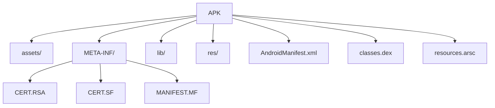

    

# **`Awesome`** [APK](https://wikipedia.org/wiki/Apk_(file_format)) (*A*_ndroid_ *P*_ac_*k*_age_) Internals 

    
    &nbsp;
    
    &nbsp;
    
    

## 📖 Contents
- [My Other Awesome Lists](#my-other-awesome-lists)
- [Contributing](#contributing)
- [Contributors](#contributors)

##

### My Other Awesome Lists
You can access the my other awesome lists [here](https://cyberthreatdefence.com/my_awesome_lists)

### Contributing
[Contributions of any kind welcome, just follow the guidelines](contributing.md)!

### Contributors
[Thanks goes to these contributors](https://github.com/cybersecurity-dev/awesome-apk-internals/graphs/contributors)!

[🔼 Back to top](#awesome-apk-android-package-internals-)
